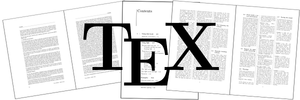

# TeX学习训练





## TeXLive下载(Windows版)
- [自动选择](http://mirror.ctan.org/systems/texlive/Images/texlive2020.iso)
- [清华大学镜像](https://mirrors.tuna.tsinghua.edu.cn/CTAN/systems/texlive/Images/texlive2020.iso)
- [北京交通大学镜像](https://mirror.bjtu.edu.cn/ctan/systems/texlive/Images/texlive2020.iso)
- [上海交通大学镜像](https://mirrors.sjtug.sjtu.edu.cn/ctan/systems/texlive/Images/texlive2020.iso)
- [中国科技大学镜像](https://mirrors.ustc.edu.cn/CTAN/systems/texlive/Images/texlive2020.iso)
- [重庆大学镜像](https://mirrors.cqu.edu.cn/CTAN/systems/texlive/Images/texlive2020.iso)
- [腾讯云镜像](https://mirrors.cloud.tencent.com/CTAN/systems/texlive/Images/texlive2020.iso)
- ……

## TeXStudio下载
- [官网下载](https://texstudio.org)


解压`.iso`文件，找到并右键单击`install-tl-advanced.bat`，以管理员权限执行即可安装。

## Tex版本

```shell
>tex -v
TeX 3.14159265 (TeX Live 2020/W32TeX)
kpathsea version 6.3.2
Copyright 2020 D.E. Knuth.
There is NO warranty.  Redistribution of this software is
covered by the terms of both the TeX copyright and
the Lesser GNU General Public License.
For more information about these matters, see the file
named COPYING and the TeX source.
Primary author of TeX: D.E. Knuth.

>latex -v
pdfTeX 3.14159265-2.6-1.40.21 (TeX Live 2020/W32TeX)
kpathsea version 6.3.2
Copyright 2020 Han The Thanh (pdfTeX) et al.
There is NO warranty.  Redistribution of this software is
covered by the terms of both the pdfTeX copyright and
the Lesser GNU General Public License.
For more information about these matters, see the file
named COPYING and the pdfTeX source.
Primary author of pdfTeX: Han The Thanh (pdfTeX) et al.
Compiled with libpng 1.6.37; using libpng 1.6.37
Compiled with zlib 1.2.11; using zlib 1.2.11
Compiled with xpdf version 4.02

>xelatex -v
XeTeX 3.14159265-2.6-0.999992 (TeX Live 2020/W32TeX)
kpathsea version 6.3.2
Copyright 2020 SIL International, Jonathan Kew and Khaled Hosny.
There is NO warranty.  Redistribution of this software is
covered by the terms of both the XeTeX copyright and
the Lesser GNU General Public License.
For more information about these matters, see the file
named COPYING and the XeTeX source.
Primary author of XeTeX: Jonathan Kew.
Compiled with ICU version 65.1; using 65.1
Compiled with zlib version 1.2.11; using 1.2.11
Compiled with FreeType2 version 2.10.1; using 2.10.1
Compiled with Graphite2 version 1.3.13; using 1.3.13
Compiled with HarfBuzz version 2.6.4; using 2.6.4
Compiled with libpng version 1.6.37; using 1.6.37
Compiled with poppler version 0.68.0
Compiled with fontconfig version 2.13.92; using 2.13.92

```

## TeX学习资料
- [LaTeX入门教程](https://www.jianshu.com/p/3e842d67ada2)
- [Liam Huang的博客](https://liam.page/categories/LaTeX/)
    - [TeXLive下载安装](https://liam.page/texlive/)
    - [TeX常用命令](https://liam.page/2014/09/08/latex-introduction/)
- [TeX在线公式编辑器](http://latex.codecogs.com/eqneditor/editor.php)
